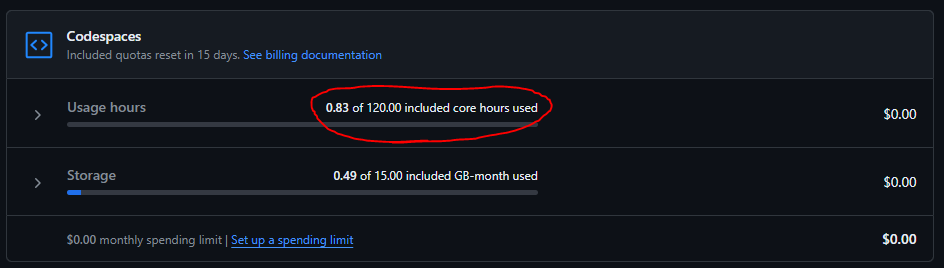
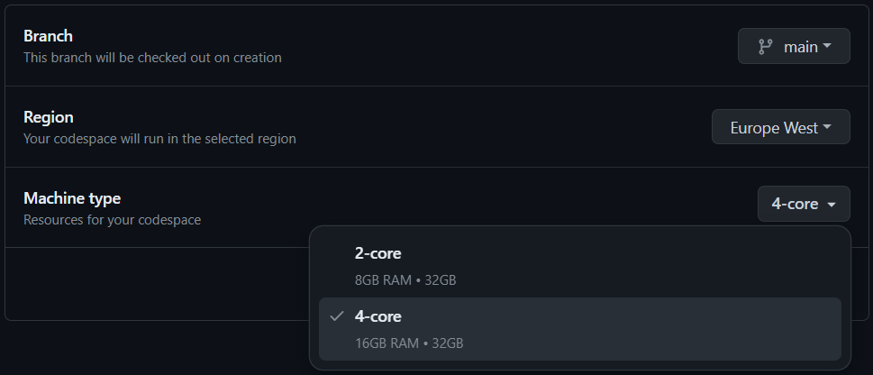
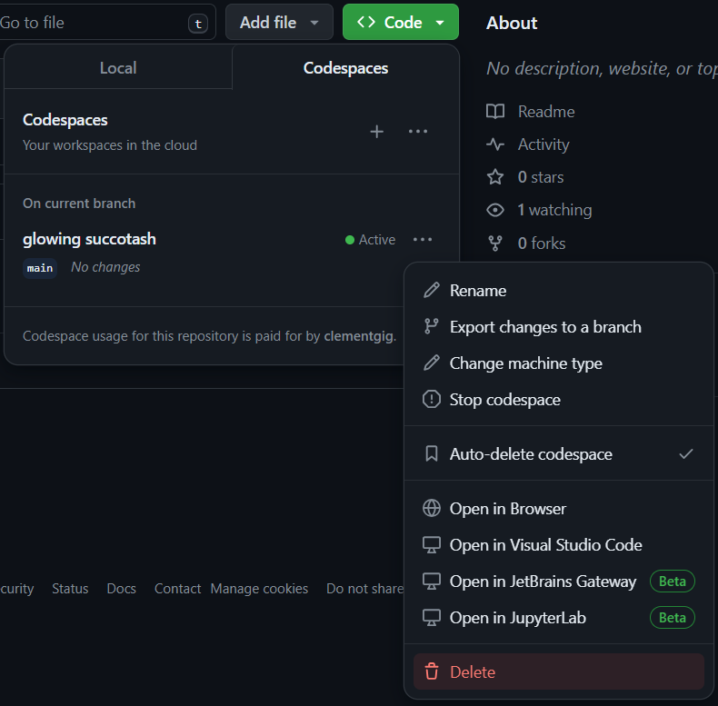

# Setup for GitHub Codespaces environment

Here are the instructions to run the workshop in GitHub Codespaces.

## Requirements

- Internet access
- Proxy policies must authorize access to https://github.com/
- Active GitHub account
- At least 20 core hours on your GitHub Codespaces quota (https://github.com/settings/billing/summary)

## Create the Codespace

1. Fork the repository to your GitHub account

2. Go to https://codespaces.new/<your GitHub Account>/spring-ai-workshop

3. Select the following options:
   - Branch: main
   - Region: Europe West
   - Machine type: 4-core

3. The Codespace environment will be opened

4. You can perform `git push` commands to save your work on your forked repository

[Go back](../../README.md)

## After the workshop

Delete the Codespace to avoid consuming core hours unnecessarily.

