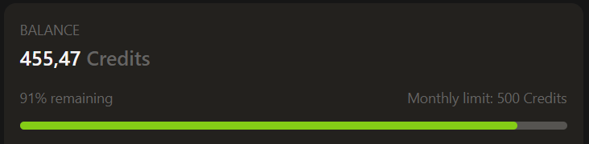
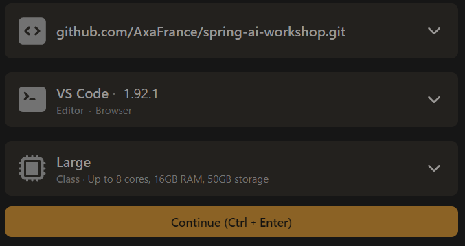

# Setup for GitPod environment

Here are the instructions to run the workshop on GitPod.

## Requirements

- Internet access
- Proxy policies must authorize access to https://gitpod.io
- Active GitPod account linked to your GitHub account 
- At least 20 credits on your GitPod balance (https://gitpod.io/billing)

## Create the GitPod Workspace

1. Fork the repository to your GitHub account

2. Go to https://gitpod.io/#github.com/<your GitHub Account>/spring-ai-workshop.git

3. Select the following options:
    - Repository: spring-ai-workshop
    - VS Code (Editor Browser)
    - Large (8 cores, 16GB RAM, 50GB storage)

3. The GitPod Workspace will be opened

4. You can perform `git push` commands to save your work on your forked repository

[Go back](../../README.md)

## After the workshop

Delete the GitPod workspace to avoid consuming core hours unnecessarily.
